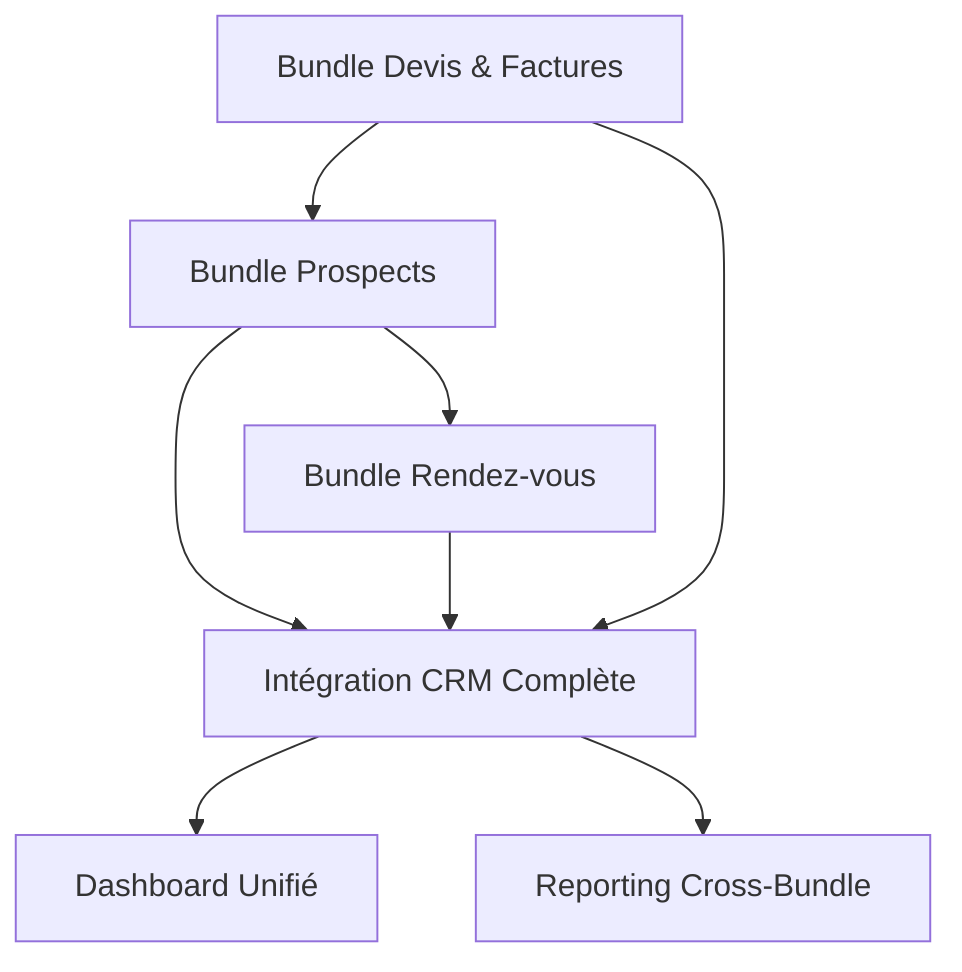

# JJA DEV CRM - Roadmap des Bundles

## 🗺️ Vue d'Ensemble de la Roadmap

Cette roadmap organise le développement des bundles CRM pour JJA_DEV selon les priorités métier et les dépendances techniques.

## 📋 Bundles à Développer

### 🎯 Priorité 1 : Bundle Devis & Factures

-   **Status** : En cours de développement
-   **Issue** : [bundle-devis-factures.md](./../ISSUE_TEMPLATE/bundle-devis-factures.md)
-   **Timeline** : T3 2024 (Juillet - Septembre)
-   **Effort estimé** : 6-8 semaines
-   **Développeur** : À assigner

**Objectifs :**

-   Génération de devis avec PDF
-   Conversion devis → facture
-   Gestion des paiements
-   Templates personnalisables
-   API REST complète

### 🎯 Priorité 2 : Bundle Gestion des Prospects

-   **Status** : Planifié
-   **Issue** : [bundle-prospects.md](./../ISSUE_TEMPLATE/bundle-prospects.md)
-   **Timeline** : T4 2024 (Octobre - Décembre)
-   **Effort estimé** : 8-10 semaines
-   **Développeur** : À assigner

**Objectifs :**

-   Pipeline commercial complet
-   Scoring automatique des leads
-   Campagnes marketing
-   Conversion prospect → client
-   Dashboard analytics

### 🎯 Priorité 3 : Bundle Gestion des Rendez-vous

-   **Status** : En attente
-   **Issue** : [bundle-appointments.md](./../ISSUE_TEMPLATE/bundle-appointments.md)
-   **Timeline** : T1 2025 (Janvier - Mars)
-   **Effort estimé** : 4-6 semaines
-   **Développeur** : À assigner

**Objectifs :**

-   Calendrier intégré responsive
-   Booking en ligne
-   Notifications automatiques
-   Sync Google Calendar/Outlook
-   Gestion des disponibilités

## 🔄 Dependencies & Workflow

## 📅 Timeline Détaillée

### T3 2024 : Bundle Devis & Factures

-   **Juillet** : Structure bundle + Entités
-   **Août** : Services métier + Controllers
-   **Septembre** : Interface admin + Tests

### T4 2024 : Bundle Prospects

-   **Octobre** : Architecture + Lead management
-   **Novembre** : Pipeline + Scoring
-   **Décembre** : Campagnes + Analytics

### T1 2025 : Bundle Rendez-vous

-   **Janvier** : Calendrier + API
-   **Février** : Interface + Booking
-   **Mars** : Intégrations + Tests

### T2 2025 : Intégration & Optimisation

-   **Avril** : Dashboard unifié
-   **Mai** : Reporting cross-bundle
-   **Juin** : Performance + Sécurité

## 🎯 Milestones Principaux

### 🏆 Milestone 1 : "CRM Foundation" (Fin T3 2024)

-   [x] Bundle Devis & Factures opérationnel
-   [x] Tests unitaires 80%+ coverage
-   [x] Documentation complète
-   [x] Déploiement production

### 🏆 Milestone 2 : "Commercial Pipeline" (Fin T4 2024)

-   [ ] Bundle Prospects intégré
-   [ ] Workflow Lead → Devis fonctionnel
-   [ ] Dashboard prospects opérationnel
-   [ ] Campagnes marketing actives

### 🏆 Milestone 3 : "Complete CRM" (Fin T1 2025)

-   [ ] Bundle Rendez-vous déployé
-   [ ] Workflow complet Lead → RDV → Devis → Facture
-   [ ] Intégrations calendriers externes
-   [ ] Booking en ligne fonctionnel

### 🏆 Milestone 4 : "CRM Advanced" (Fin T2 2025)

-   [ ] Dashboard unifié tous bundles
-   [ ] Reporting et analytics avancés
-   [ ] API publique documentée
-   [ ] Performance optimisée

## 🔧 Configuration GitHub Projects

### Colonnes Kanban

1. **📋 Backlog**

    - Issues non assignées
    - Idées et améliorations

2. **🔄 To Do**

    - Issues prêtes à développer
    - Assignées avec priorité

3. **⚡ In Progress**

    - Développement en cours
    - Maximum 3 issues par développeur

4. **👀 Review**

    - Pull Requests en attente
    - Code review requis

5. **✅ Done**
    - Issues terminées et déployées
    - Archive automatique après 30 jours

### Labels de Priorité

-   🔴 `priority:critical` - Bugs bloquants
-   🟠 `priority:high` - Fonctionnalités importantes
-   🟡 `priority:medium` - Améliorations
-   🟢 `priority:low` - Nice to have

### Labels par Bundle

-   🏷️ `bundle:quote-invoice` - Bundle Devis & Factures
-   🏷️ `bundle:prospects` - Bundle Prospects
-   🏷️ `bundle:appointments` - Bundle Rendez-vous
-   🏷️ `bundle:integration` - Intégrations cross-bundle

### Labels Techniques

-   🔧 `enhancement` - Nouvelle fonctionnalité
-   🐛 `bug` - Correction de bug
-   📚 `documentation` - Documentation
-   🧪 `testing` - Tests
-   🚀 `deployment` - Déploiement

## 📊 Métriques & Suivi

### KPIs de Développement

-   **Velocity** : Story points par sprint
-   **Code Coverage** : Minimum 80% par bundle
-   **Code Quality** : PHPStan niveau 8
-   **Documentation** : 100% classes documentées

### KPIs Métier

-   **Time to Market** : Délai de livraison par bundle
-   **User Adoption** : Utilisation des fonctionnalités
-   **Performance** : Temps de réponse < 200ms
-   **Satisfaction** : Feedback utilisateurs

## 🚀 Quick Start Guide

### Pour Contribuer

1. **Choisir une issue** dans "To Do"
2. **Créer une branche** `feature/issue-XXX-description`
3. **Développer** selon les standards JJA_DEV
4. **Tester** (couverture 80%+)
5. **Pull Request** vers `develop`

### Standards Requis

-   ✅ PSR-12 compliance
-   ✅ PHPStan niveau 8
-   ✅ Tests unitaires et fonctionnels
-   ✅ Documentation PHPDoc
-   ✅ Integration CMS_SF

## 📞 Contacts & Support

-   **Project Owner** : À définir
-   **Tech Lead** : À définir
-   **Documentation** : [GitHub Wiki](./../../wiki)
-   **Issues** : [GitHub Issues](./../../issues)

---

**Note** : Cette roadmap est un document vivant mis à jour selon l'avancement du projet et les retours utilisateurs.
