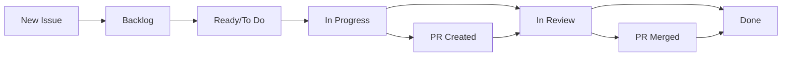

# Configuration Tableau Kanban GitHub - JJA_DEV

## Recommandation pour GitHub Projects

Actuellement, **aucun tableau Kanban n'est configuré** sur le repository `jeanniardJ/JJA_DEV`.

## Avantages d'un Tableau Kanban GitHub

### 🎯 **Gestion Centralisée**

-   **Issues tracking** : Suivi centralisé des tâches
-   **Workflow visuel** : État d'avancement en temps réel
-   **Assignations** : Responsabilités claires
-   **Milestones** : Objectifs et deadlines

### 🔄 **Colonnes Recommandées pour JJA_DEV**

1. **📋 Backlog**

    - Nouvelles issues
    - Features à implémenter
    - Bugs reportés

2. **🔄 Ready/To Do**

    - Issues priorisées
    - Prêtes pour développement
    - Spécifications validées

3. **👨‍💻 In Progress**

    - Développement en cours
    - Issues assignées
    - Work in progress

4. **🧪 In Review/Testing**

    - Pull requests en review
    - Tests en cours
    - Validation qualité

5. **✅ Done**
    - Features terminées
    - Issues fermées
    - Releases déployées

## Structure Adaptée au Projet CRM

### **Labels Recommandés**

```yaml
# Types de tâches
- type: feature (nouvelles fonctionnalités CRM)
- type: bug (corrections)
- type: enhancement (améliorations)
- type: documentation

# Composants
- component: crm (fonctionnalités CRM)
- component: bundle (devis/factures)
- component: frontend (interface utilisateur)
- component: backend (API/services)
- component: database (migrations/modèles)

# Priorités
- priority: critical (bloquant)
- priority: high (important)
- priority: medium (normal)
- priority: low (nice-to-have)

# Status workflow
- status: needs-design (besoin spécification)
- status: ready-dev (prêt développement)
- status: needs-review (en attente review)
- status: needs-testing (test requis)
```

### **Milestones Suggérés**

1. **v1.0 - Core CRM** (Issues #14, #15, #16)

    - Bundle Prospects
    - Bundle Devis/Factures
    - Bundle Rendez-vous

2. **v1.1 - Interface & UX**

    - Dashboard CRM
    - Rapports et statistiques
    - Interface mobile

3. **v1.2 - Intégrations**
    - API REST
    - Exports/Imports
    - Notifications

## Comment Créer le Tableau Kanban

### **Étape 1 : Accès GitHub Projects**

1. Aller sur : https://github.com/jeanniardJ/JJA_DEV
2. Cliquer sur l'onglet **"Projects"**
3. Cliquer **"New project"**

### **Étape 2 : Configuration**

-   **Template** : "Board" (vue Kanban)
-   **Nom** : "JJA_DEV CRM Development"
-   **Description** : "Suivi développement plateforme CRM Symfony"

### **Étape 3 : Personnalisation**

-   Ajouter les colonnes recommandées
-   Configurer les labels
-   Créer les milestones
-   Lier les issues existantes (#14, #15, #16)

### **Étape 4 : Automatisation**

-   **Auto-move** : Issues → Ready quand assignées
-   **Auto-close** : Ready → Done quand PR mergée
-   **Notifications** : Alerts sur changements status

## Workflow Recommandé

### **Flux de Travail Type**



### **Processus de Développement**

1. **Création Issue** → Auto-assignation "Backlog"
2. **Priorisation** → Move vers "Ready/To Do"
3. **Assignation** → Move vers "In Progress"
4. **Pull Request** → Move vers "In Review"
5. **Merge/Deploy** → Move vers "Done"

## Intégration avec le Workflow Actuel

### **Issues Existantes à Organiser**

```yaml
# Issues actuelles à intégrer
- Issue #14: Bundle Devis/Factures → v1.0 milestone
- Issue #15: Bundle Prospects → v1.0 milestone
- Issue #16: Bundle Rendez-vous → v1.0 milestone

# Nouvelles issues à créer
- Dashboard CRM admin
- API REST endpoints
- Tests d'intégration
- Documentation utilisateur
```

### **Intégration CI/CD**

Le workflow GitHub Actions peut automatiquement :

-   **Créer issues** depuis commits avec keywords
-   **Mettre à jour status** selon les PR
-   **Fermer issues** automatiquement
-   **Notifier équipe** des changements

## Bénéfices Attendus

### **📈 Productivité**

-   **Visibilité** : État d'avancement clair
-   **Priorisation** : Focus sur l'essentiel
-   **Collaboration** : Communication améliorée
-   **Historique** : Traçabilité complète

### **🎯 Organisation**

-   **Planification** : Roadmap visible
-   **Deadlines** : Respect des échéances
-   **Qualité** : Process de review structuré
-   **Documentation** : Issues comme documentation

## Actions Recommandées

### **🚀 Immédiat**

1. Créer le projet Kanban GitHub
2. Configurer les colonnes et labels
3. Intégrer les 3 issues existantes (#14, #15, #16)

### **📋 Court terme**

1. Créer les milestones v1.0, v1.1, v1.2
2. Décomposer les issues complexes
3. Configurer l'automatisation workflow

### **🔄 Moyen terme**

1. Intégrer avec les GitHub Actions existantes
2. Former l'équipe aux bonnes pratiques
3. Optimiser le processus selon feedback

## Conclusion

Un tableau Kanban GitHub Projects transformera la gestion du projet JJA_DEV en apportant :

-   **Structure** au processus de développement
-   **Visibilité** sur l'avancement
-   **Collaboration** renforcée
-   **Qualité** améliorée grâce aux reviews

**Priorité** : Configuration recommandée immédiatement pour structurer le développement des bundles CRM.
